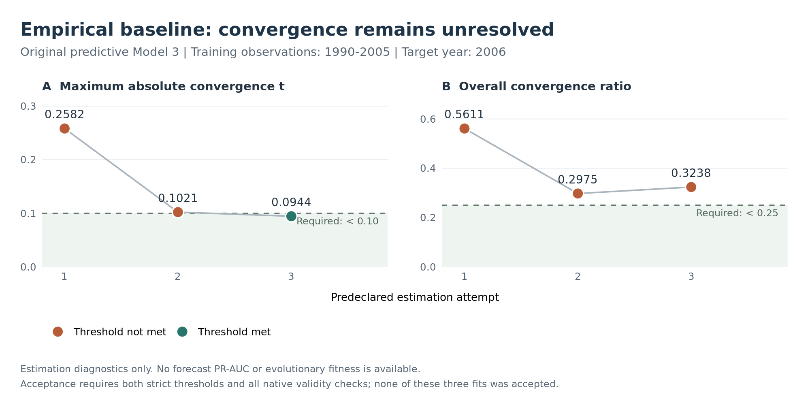

<div align="center">

<sub>COMPUTATIONAL RESEARCH REPORT · REPRODUCTION & PRESPECIFIED EXTENSION</sub>

# Free Riding, Network Effects,<br>and Predictive Specification Evolution

**Reconstructing Kinne & Kang’s defense-cooperation model with RSiena and ShinkaEvolve**

20 September 2026 · Research checkpoint 01 · [Original paper](https://doi.org/10.1017/S0020818322000315)

[Abstract](#abstract) · [Model](#2-original-model-and-reconstruction) · [Methods](#3-prespecified-evolution-and-evaluation) · [Results](#4-results) · [Reproduce](#7-reproducibility-and-artifacts)

---

</div>

## Abstract

Can interpretable changes to the countries’ network-objective specification improve prediction of future defense cooperation agreements (DCAs)? We reconstruct Kinne and Kang’s continuous-time network–behavior model using the original **R 4.2.1 / RSiena 1.3.10** engine and define a separate temporal experiment with fixed **PRROC 1.3.1** fitness. Candidate structures retain the empirical controls and defense-spending objective; coefficients are estimated from past observations. Development fitness is the equally weighted improvement in annual PR-AUC for 2006–2009 over the original predictive Model 3, refitted on the same training observations. The 2010 target is reserved from evolutionary selection. At this checkpoint, independent source-parity and native leakage checks pass, and **86 original-source endpoint simulations** have completed across seven experimental settings. The first empirical forecast baseline, trained on 1990–2005, fails the declared convergence policy after three attempts. Consequently, **no predictive fitness or evolutionary improvement is established**. Native Shinka infrastructure is verified, while the scientific campaign remains gated on valid estimation.

| Original-source execution | Independent source parity | Accepted forecast baselines | Evolutionary evaluations |
|:---:|:---:|:---:|:---:|
| **7 settings · 86 endpoints** | **18 / 18 checks passed** | **0** | **0 valid** |

## 1. Research question

> Can a modified network-objective specification improve held-out DCA tie PR-AUC relative to the original empirical specification, when both are refitted on exactly the same training observations?

The experiment separates two functions:

| Function | Scientific role | What may change? |
|---|---|---|
| **Countries’ network objective** | Governs stochastic tie choices inside RSiena | Supported network statistics; their coefficients are statistically re-estimated |
| **Evolutionary fitness** | Measures predictive improvement in [`evaluate.py`](evaluate.py) | Fixed evaluator, splits, observations, forecast rules and metric |

Candidate programs cannot redefine their fitness. This project studies predictive model specification; improved prediction would not establish improved national security or optimal policy. There is no partnership-search or national-strategy optimization component.

## 2. Original model and reconstruction

The empirical model jointly represents an **undirected DCA network** and **ordinal defense effort**. In continuous time, actors receive opportunities to change ties or spending. Symmetric tie proposals use unilateral initiative with partner confirmation (`modelType=3`); spending moves one category per opportunity (`behModelType=1`). Spending/GDP is discretized into 11 left-closed categories. Spending RMSE is therefore reported in **ordinal category units**.

The predictive reference is **Model 3**. Its network objective includes density, total degree, transitive triads, alter spending, democracy and material capabilities, plus alliance, distance, UN voting distance, trade and NATO dyadic controls. The spending objective retains its linear/quadratic shapes, seven controls, network degree and dense-triad effect. Model 4’s additional free-riding interaction is absent.

The illustrative ABM uses generated covariates and assigned coefficients. These coefficients are not fitted contemporary-country preferences. Its `degPlus` internal parameter is **2** (square-root degrees), whereas empirical Model 3 uses the native default **1** (raw degrees).

| Execution mode | Scientific purpose | Preserved or declared protocol |
|---|---|---|
| `paper_reproduction` | Reconstruct the authors’ results | Original source, sample, settings, seeds and native engine; discrepancies recorded |
| `evolution_forecast` | Test structural predictive improvement | Prespecified annual, past-only, unconditional forecasts and fixed PR-AUC fitness |

Three consequential source differences are retained in the record: the appendix describes training through **2009**, but its caller uses **1990–2008**; validation restores rates initialized from observed **2009–2010** data; and SAOM scoring flattens both symmetric directions while the logit comparison uses unordered pairs. The extension explicitly changes those forecast choices.

**Source audit:** [equation/effect mapping](docs/SOURCE_MODEL_MAP.md) · [paper reproduction protocol](docs/PAPER_REPRODUCTION.md) · [deviations](DEVIATIONS.md)

## 3. Prespecified evolution and evaluation

### 3.1 Temporal design

Each model is fitted using only observations available before its target year. Forecasts start at the observed origin state and span one annual interval.

| Use | Target | Training observations | Forecast interval |
|---|---:|---|---|
| Development | 2006 | 1990–2005 | 2005 → 2006 |
| Development | 2007 | 1990–2006 | 2006 → 2007 |
| Development | 2008 | 1990–2007 | 2007 → 2008 |
| Development | 2009 | 1990–2008 | 2008 → 2009 |
| Reserved final comparison | **2010** | **1990–2009** | **2009 → 2010** |

Rates carry forward from the last estimable training interval. Covariates and composition use information at the origin. Simulations are unconditional, preserve training centering and behavior support, and cannot condition on target-year changes. Predictions are committed before a separate scorer opens outcomes.

The final year is held out **from this evolutionary search**. It is not historically untouched: the original study already examined 2010. Final scoring requires a sealed selected structure and protocol.

### 3.2 Fixed predictive fitness

For candidate $C$, target year $t$, and eligible undirected pair $i<j$, simulate exactly $S=1000$ endpoint networks and average binary ties **before** computing a curve:

$$
p_C(i,j,t)=\frac{1}{1000}\sum_{s=1}^{1000} A_{C,s}(i,j,t).
$$

The metric is the pinned PRROC integral, with the positive class supplied as `scores.class0`:

```r
PRROC::pr.curve(
  scores.class0 = probabilities[observed_labels == 1],
  scores.class1 = probabilities[observed_labels == 0],
  curve = FALSE
)$auc.integral
```

Let $B_t$ denote the original predictive specification refitted through $t-1$. The independent evolutionary fitness is

$$
\boxed{F(C)=\frac{1}{4}\sum_{t=2006}^{2009}
\left[\operatorname{PR\!AUC}(C,t)-\operatorname{PR\!AUC}(B_t,t)\right].}
$$

**Positive $F$ means better average development PR-AUC.** Years have equal weight. Negative improvements remain negative. There are no complexity, runtime, spending or qualitative bonuses. Native Shinka receives `combined_score = 1 + F` to avoid its pinned archive’s exact-zero handling bug; raw $F$ is retained.

Each eligible pair is scored once. Diagonals, origin-missing pairs, missing outcomes and structurally invalid dyads are excluded using a common, candidate-independent mask. Every development year must succeed. A failed fit has **invalid/null fitness**, never a fabricated loss or a partial-year mean. The PRROC integral is not sklearn average precision.

### 3.3 Interpretable search space

The candidate interface produces a literal, validated specification:

```python
def build_network_spec(allowed_schema):
    return {
        "schema_version": 1,
        "network_effects": ["degPlus", "transTriads"],
    }
```

The fixed catalog supports `degPlus`, `transTriads`, `inPop`, and `gwesp` with its native internal parameter 69. At most three mutable effects are allowed: **15 possible subsets**, including the original specification. Density, empirical controls and spending structure remain fixed. A restricted AST interpreter accepts data without executing candidate Python. The trusted R adapter constructs real RSiena effects and estimates their coefficients; arbitrary Python utility functions are not injected into the simulator.

Canonical identities distinguish mathematical specifications from cosmetic rewrites. Common seeds, estimation rules and simulation budgets apply across comparisons. ROC-AUC, Brier score, ordinal spending RMSE, formation/dissolution performance, persistence, structural diagnostics, computational cost and complexity are reported separately. A subset without both classes has no valid AUC.

**Complete specification:** [evaluator v1](docs/EVALUATOR_SPEC_v1.md) · [effect catalog](configs/effect-catalog-v1.json) · [selection and final-test rules](docs/SELECTION.md)

## 4. Results

### 4.1 Original-source simulation: partial reproduction


*Figure 1. Completed original equilibrium-diagnostic cells. Bars show 99% simulation-mean intervals. Six low-rate settings do not establish equilibrium or reproduce the full published curve.* [PDF](results/paper_reproduction/abm-full-equilibria/partial_equilibrium.pdf) · [plot data](results/paper_reproduction/abm-full-equilibria/partial_equilibrium_plot_data.csv) · [all endpoint observations](results/paper_reproduction/abm-full-equilibria/endpoint_diagnostics.csv)

| Both process rates | Endpoints | Mean spending category | Mean density | Mean clustering |
|---:|---:|---:|---:|---:|
| 1 | 10 | 1.85912 | 0.037879 | 0.267024 |
| 5 | 10 | 2.18365 | 0.082509 | 0.166883 |
| 10 | 10 | 2.53396 | 0.131494 | 0.165274 |
| 15 | 10 | 2.80692 | 0.174270 | 0.190701 |
| 20 | 10 | 2.99560 | 0.211806 | 0.221878 |
| 25 | 10 | 3.19371 | 0.244821 | 0.251051 |

The **first Figure 5 public-goods cell** also completed with the original 159-country calibration, opportunity rates 200 and spending-degree coefficient $\gamma=-0.05$. A requested `n3=25` yields **26 actual endpoints** under native two-worker rounding. Mean defense effort was **1.023464 categories**, density **0.496865**, and clustering **0.496518**. The native call took **626.613 seconds**. This is one grid point, not the complete Figure 5 curve. [Native specification and summary](results/paper_reproduction/abm-full/endpoint_summary.json) · [endpoint data](results/paper_reproduction/abm-full/endpoint_diagnostics.csv)

Both original drivers are **paused at completed-call checkpoints**. No scientific process remains running at this publication checkpoint.

### 4.2 Empirical baseline: convergence not achieved



*Figure 2. Estimation diagnostics for Model 3 trained on 1990–2005. Both strict criteria must pass. The third attempt passes the parameterwise criterion but fails overall convergence. This is an estimation diagnostic, not a predictive comparison.* [PDF](results/evolution_forecast/convergence/baseline_convergence.pdf) · [plot data](results/evolution_forecast/convergence/baseline_convergence_plot_data.csv)

| Attempt | Runtime (s) | Maximum absolute convergence $t$ | Overall convergence | Accepted |
|---:|---:|---:|---:|:---:|
| 1 | 664.205 | 0.258198394145 | 0.561063321743 | No |
| 2 | 597.301 | 0.102125124334 | 0.297489294752 | No |
| 3 | 618.160 | 0.094447585313 | 0.323754366293 | No |
| **Required** | — | **< 0.1** | **< 0.25** | **Both** |

The three-attempt policy is exhausted. No prediction from these fits was scored. The [initial evaluator output](results/evolution_forecast/initial/metrics.json) records `combined_score: null`, `raw_F: null`, and actionable failure feedback. Full native fit objects, coefficients, covariance diagnostics, errors and runtime records are retained in the [baseline cache](results/cache/7e68932cdb5e36c240411e968554f4cdc211ddc6bd453fb6a8b9fc47ebe8be4d/).

This finding establishes a failure to converge under the declared policy. It does not establish worse prediction, non-estimability, or an evolutionary improvement.

### 4.3 Coverage and reference values

| Scientific milestone | Evidence at this checkpoint |
|---|---|
| Original equilibrium diagnostic | **6 / 101** settings; 60 endpoints |
| Figures 5–7 simulation campaign | **1 / 564** settings; 26 endpoints |
| First temporal baseline | Three completed attempts; **no accepted fit** |
| Full four-year baseline / seed-zero check | Incomplete |
| Structural candidate / conventional search | Implemented; no valid evaluation |
| Native evolutionary campaign | Configured; not launched |
| Fresh-randomness finalist / final 2010 comparison | Not executed |
| Main empirical results / original appendix validation | Callers prepared; execution deferred |

The authors’ published **PR-AUC 0.927**, **ROC-AUC 0.985**, and **spending RMSE 0.397** are reference values, not results obtained here or values inserted into the evaluator. The extension’s changed forecasting protocol need not reproduce them.

## 5. Verification and scientific safeguards

| Check | Executed evidence |
|---|---|
| Archive identity | Dataverse v1.0; supplied SHA256 verified; CC0-1.0 metadata preserved |
| Native implementation | Exact R 4.2.1 / RSiena 1.3.10; all 795 archived RSiena source files unchanged |
| Data and Model 3 parity | **18 comparisons passed** against the original source; 35.15 s, 612,504 KB peak RSS |
| Metric aggregation | Averaged probabilities yield fixture AUC **1.0**; averaging hard-network AUCs incorrectly gives **2/3** |
| PRROC numerical definition | Positive scores (.8, .4), negative (.6, .2): integral **0.79726744594591781** |
| Future-outcome independence | Altered inaccessible synthetic targets leave native predictions identical with past/specification/seeds fixed |
| Native composition and support | Inactive actors remain inactive, inactive ties stay zero, active ties can form/dissolve, behavior support remains 1–11 |
| Restricted programs | Eight invalid/malicious cases rejected; canonical identity verified |
| Native evaluator contract | Invalid candidate ingested with SQL `NULL` fitness and excluded from archive/best selection |

The leakage/composition check uses four native endpoints per condition with initial coefficients. It is a **mechanics diagnostic**, not an accepted empirical forecast. Review uncovered two RSiena 1.3.10 composition pitfalls; the corrected adapter uses origin-known inactive flags and native structural zeros only on invalid dyads. Older forecast schemas are rejected. All corrections and failed checks remain documented in [DEVIATIONS.md](DEVIATIONS.md).

## 6. Native ShinkaEvolve

The upstream engine is pinned to [`9912af1`](https://github.com/SakanaAI/ShinkaEvolve/tree/9912af12d423504b8d580f4179fd15f5f88b8c50). Evolution uses native machinery; the project does not provide a replacement evolution controller.

| Layer | Configuration and observed status |
|---|---|
| Population and variation | Two islands; archive and parent sampling; diff/full/crossover mutations; executable and top-performing inspirations — **configured** |
| Adaptation | Migration, meta-recommendations and prompt co-evolution every three generations; text feedback enabled — **not observed in evolution** |
| Novelty | Genuine local Model2Vec embeddings tested; native adjudication configured; mathematical novelty tracked separately |
| Mutation route | Subscription-backed Astra, `ultra` requested/forwarded; two administrative route checks succeeded; achieved effort is not echoed |
| Isolation | Protected files and past sessions hidden; separate network namespace; exact subscription-host egress; literal candidate interpreter |
| Persistence and inspection | Native SQLite, resumption and WebUI configured; invalid-fixture ingestion and HTTP availability tested |
| Accounting | **2 administrative model calls · 28,571 reported tokens · 0 evolutionary calls · no paid API fallback** |

A single authorized mutation model is configured, so no meaningful multi-model bandit comparison is claimed. The provisional 12-generation campaign requires accepted scientific gates and a finite budget derived from measured fitting cost. A synthetic prompt test does not establish an actual descendant, migration, meta event or evolved prompt.

**Evidence:** [full capability matrix](docs/SHINKA_CAPABILITIES.md) · [resolved native configuration](runs/evolution_native/resolved_config.json) · [adapter contract](docs/SHINKA_CONTRACT.md)

## 7. Reproducibility and artifacts

### Environment and verification

```bash
git clone https://github.com/ReloadLightly/shinka-cooperation-network.git
cd shinka-cooperation-network

python3 scripts/fetch_sources.py
bash scripts/bootstrap_environment.sh
environment/run-r environment/verify.R
environment/run-r R/audit_data.R
python3 scripts/research.py audits
```

The exact package lock, source checksums and session information are versioned. The host/compiler/OpenBLAS and some ancillary package builds differ from the authors’ environment; [environment notes](environment/README.md) record those differences.

### Resume original-source work

```bash
# Each command checkpoints one additional native call, then exits 75 to pause.
python3 scripts/paper_reproduction.py --profile full --max-new-calls 1
python3 scripts/paper_reproduction.py --profile full --stage equilibria --max-new-calls 1

# Inspect recorded state and refresh result manifests.
python3 scripts/research.py status
python3 scripts/update_manifests.py
```

Run large R jobs serially on a host with similar memory constraints. The original two-worker ABM needs local socket access. Automatic checkpoint reuse currently depends on the original ABM paths and unchanged empirical provenance files; a fresh clone or environment verification can trigger recomputation. See the [runbook caveat](docs/RUNBOOK.md#checkpoint-portability) before resuming. With an unchanged cache identity, the exhausted empirical v1 retry policy preserves its failure instead of adding attempts. Further predictive work requires a versioned fitting-policy revision applied equally to baseline and candidates before comparison.

| Artifact | Contents |
|---|---|
| [Reproduction manifest](results/reproduction_manifest.json) | Coverage, completed cells, native specifications and process outcomes |
| [Evolution manifest](results/evolution_manifest.json) | Baseline attempts, invalid evaluator result and unfulfilled launch gates |
| [Scientific result archive](results/) | RDS checkpoints and fits, endpoint data, figures, audits, stdout/stderr and resource logs |
| [Publication inventory](docs/PUBLICATION.md) | Included artifacts, SHA256 inventory and packaging scope |
| [Chronological research log](RESEARCH_LOG.md) | Commands, discoveries, failures, corrections and measured costs |
| [Execution runbook](docs/RUNBOOK.md) | Full setup, evaluator and native launch commands |
| [Selection protocol](docs/SELECTION.md) | Conventional comparison, fresh randomness, selection lock and final-test commands |

The original [IO_Final.zip](sources/archive/IO_Final.zip) is retained with SHA256:

```text
2f4c2c02e3969437976c505098848e0ef7333466aeba3cccd807b3b44ba75308
```

Installed runtimes, package caches, credentials and redundant working copies are excluded from Git. Original source files are regenerated from the verified archive and checked against the [source manifest](sources/manifest.json). The scientific results, including failed fits, are published as evidence.

## 8. Limitations and remaining work

The reproduction is partial, and the forecasting question remains unanswered. The first baseline’s convergence failure prevents a valid four-year comparison. Estimation must become acceptable under a newly recorded, consistently applied policy before the structural candidate and native campaign proceed. The next scientific stages are complete baseline validation, seed-zero verification, structural evolution, conventional search under a comparable budget, fresh Monte Carlo checks, and a sealed 2010 comparison.

Tie persistence may dominate overall AUC; formation and dissolution diagnostics remain necessary. One fresh simulation replicate measures limited Monte Carlo sensitivity, not coefficient uncertainty. Dependent dyads must not be treated as independent observations for a naïve significance test. Full Figures 5–7, the equilibrium curve, main empirical estimates and original validation are unfinished. The original 2010-based empirical callers are prepared but deferred until the reserved final comparison is complete.

## References and reuse

1. **Kinne, Brandon J., and Stephanie N. Kang.** 2023. “Free Riding, Network Effects, and Burden Sharing in Defense Cooperation Networks.” *International Organization* 77(2): 405–439. [Paper](https://doi.org/10.1017/S0020818322000315) · [Appendix](https://static.cambridge.org/content/id/urn:cambridge.org:id:article:S0020818322000315/resource/name/S0020818322000315sup001.pdf).
2. **Replication data**, version 1.0. Harvard Dataverse, [doi:10.7910/DVN/S0ILRB](https://doi.org/10.7910/DVN/S0ILRB), file 6429192. Dataset metadata declares **CC0-1.0**; the paper separately declares **CC BY-NC 4.0**.
3. **RSiena**, [release 1.3.10](https://github.com/stocnet/rsiena/releases/tag/v1.3.10). Original native simulation engine; [environment provenance](environment/provenance.json).
4. **ShinkaEvolve**, [source](https://github.com/SakanaAI/ShinkaEvolve) and [documentation](https://sakanaai.github.io/ShinkaEvolve/). Pinned commit and compatibility changes: [provenance](shinka/provenance.json) · [third-party notices](shinka/THIRD_PARTY_NOTICES.md).
5. **PRROC**, [package documentation](https://cran.r-project.org/web/packages/PRROC/PRROC.pdf). Scoring uses pinned **1.3.1**, with [installed-version semantics](sources/reference/PRROC-1.3.1-help.txt) and executed numerical fixtures; the live PDF may describe a newer release.

---

<div align="center">
<sub>Inspect the evidence · Preserve the protocol · Separate execution from scientific success</sub>
</div>
