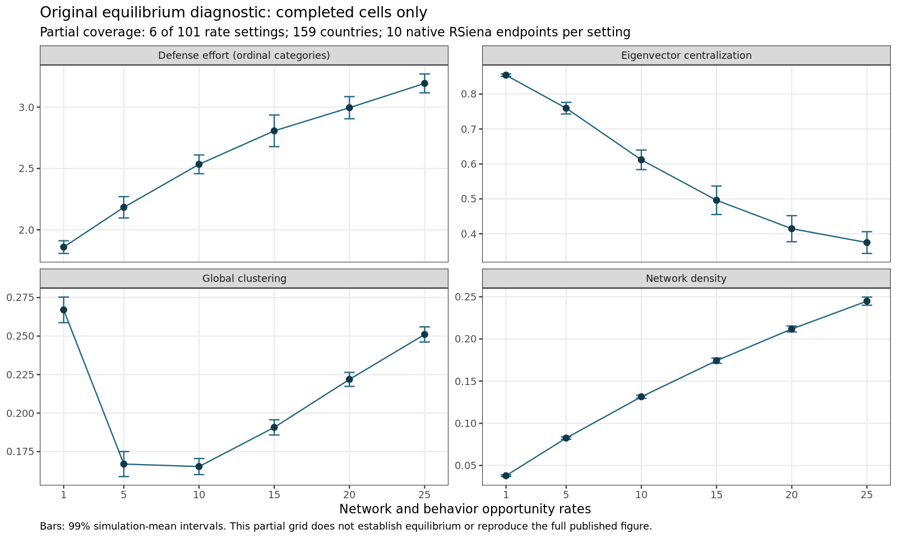

<div align="center">

<sub>COMPUTATIONAL RESEARCH REPORT · REPRODUCTION & PRESPECIFIED EXTENSION</sub>

# Defense-Cooperation Networks: Replication and Predictive Model Discovery.

**Reconstructing Kinne & Kang’s defense-cooperation model with RSiena and ShinkaEvolve**

21 September 2026 · Recoverable research campaign · [Original paper](https://doi.org/10.1017/S0020818322000315)

[Abstract](#abstract) · [Model](#2-original-model-and-reconstruction) · [Methods](#3-prespecified-evolution-and-evaluation) · [Results](#4-results) · [Reproduce](#7-reproducibility-and-artifacts)

---

</div>

## Abstract

Can ShinkaEvolve discover interpretable alternative network-selection specifications that improve forecasts of defense-cooperation agreements and defense spending relative to Kinne and Kang’s Model 3? We reconstruct the original model using **R 4.2.1 / RSiena 1.3.10**, and conduct a separate, strict temporal forecasting extension. Network mechanisms may evolve; empirical controls and the spending equation’s structure remain fixed, with all coefficients jointly reestimated. **Multiobjective-v1** measures equally weighted 2006–2009 improvements in PRROC PR-AUC, tie-probability Brier score and ordinal-spending RMSE. All four reference forecasts have completed with 1,000 endpoints each; their PR-AUCs are **0.885308, 0.941662, 0.914560 and 0.949362**. Each improves ranking over persistence while having slightly worse Brier score. The 2009 fourth continuation passed after recovery from host memory exhaustion, with unchanged scientific settings, seed and convergence thresholds. The historical PR-only seed evaluation returns exactly **F=0**. No changed specification or evolutionary improvement is established. Fixed-coefficient numerical audits are reported separately; a bounded changed-model comparison and uncertainty-aware selection remain outstanding. Original-source reproduction remains partial: **86 endpoints across seven settings**. The authors favor an efficiency interpretation; our predictive extension cannot independently establish that explanation or improved security.

| Original-source execution | Accepted reference forecasts | Unique changed-model evaluations | Native evolutionary proposals |
|:---:|:---:|:---:|:---:|
| **7 settings · 86 endpoints** | **4 / 4 development years** | **0 complete** | **0** |

## Prospective convergence policy for the next comparison

The separately versioned **precision-before-continuation-v1** estimator is
implemented and validated using saved-fixture replay and stopped native
initialization. Eligible ratio-failing 1,000-draw fits receive one fixed
3,000-draw assessment at unchanged coefficients before another optimization
continuation. Thresholds and native validity checks are unchanged; valid
short fits still pass without reassessment. This is **opt-in, fit-only**:
historical evaluators and results remain unchanged. The separately declared Step 4 comparison below now explicitly consumes the new receipts.
See [policy and handoff](docs/PRECISION_CONVERGENCE_POLICY.md) and
[validation evidence](results/diagnostics/precision-policy-v1/REPORT.md).

## Step 4: declared closure comparison launched

The single **reference versus GWESP(69)** comparison is implemented and was
launched in Actions run **35626907047**. This section records the launch,
not a completed result. The running workers use their frozen source commit;
documentation publication does not restart or modify their numerical work.

Both specifications retain the original empirical controls and spending
structure; only `transTriads(0)` is replaced by native `gwesp(69)` (alpha 0.69).
The precision policy is applied consistently, including audited replay of
the reference's 15 immutable optimization checkpoints, not historical
acceptance labels. The new forecast consumer uses `authoritative_n3`.

The finite plan is **eight model/year cells**, development years 2006–2009,
and five 1,000-endpoint forecast batches per accepted cell. Primary annual
points pool all 5,000 endpoints **before** scoring. Independent batch
contrasts and an explicitly approximate five-block jackknife quantify
conditional forecast Monte Carlo uncertainty, not fitting or historical
generalization uncertainty. No decay search, Shinka run or 2010 scoring.

Preflight passed **191 Python tests and 57 pinned-R checks**, including two
actual receipt-aware forecast initializations stopped before simulation.
See the [frozen design](docs/STEP4_COMPARISON.md) and
[preflight evidence](results/diagnostics/step4-preflight-v1/execution.json).
Each running model/year has a four-hour native-process budget; incomplete
or failed cells are preserved, never replaced with another seed or a
partial four-year score. Result branches are `repairs/step4-results/*`;
the collector writes `repairs/step4-comparison-results-20260921` for review.
Final results are not asserted here before that evidence is inspected.

## 1. Research question

> Can ShinkaEvolve discover interpretable alternative network-selection specifications that improve forecasts of defense-cooperation agreements and defense spending relative to Kinne and Kang’s Model 3?

The experiment separates two functions:

| Function | Scientific role | What may change? |
|---|---|---|
| **Countries’ network objective** | Governs stochastic tie choices inside RSiena | Native statistics, functional parameters and compatible interactions; coefficients are statistically reestimated |
| **Evolutionary fitness** | Measures improvement through the trusted evaluator | Fixed objectives, splits, observations and forecast rules |

Candidate programs cannot redefine their fitness. This project studies predictive model specification; improved prediction would not establish improved national security or optimal policy. There is no partnership-search or national-strategy optimization component.

## 2. Original model and reconstruction

The empirical model jointly represents an **undirected DCA network** and **ordinal defense effort**. In continuous time, actors receive opportunities to change ties or spending. Symmetric tie proposals use unilateral initiative with partner confirmation (`modelType=3`); spending moves one category per opportunity (`behModelType=1`). Spending/GDP is discretized into 11 left-closed categories. Spending RMSE is therefore reported in **ordinal category units**.

The predictive reference is **Model 3**. Its network objective includes density, total degree, transitive triads, alter spending, democracy and material capabilities, plus alliance, distance, UN voting distance, trade and NATO dyadic controls. The spending objective retains its linear/quadratic shapes, seven controls, network degree and dense-triad effect. Model 4’s additional effort-dependent spending term is absent. The authors’ comparison favors **efficiency rather than free riding**. Source agreement in inputs and effects establishes reconstruction, not reproduction of fitted estimates or substantive conclusions. Retaining Model 3’s spending structure cannot independently reproduce the Model 4 efficiency-versus-free-riding comparison. Spending coefficients are jointly reestimated for every candidate, so network changes can alter spending forecasts.

The illustrative ABM uses generated covariates and assigned coefficients. These coefficients are not fitted contemporary-country preferences. Its `degPlus` internal parameter is **2** (square-root degrees), whereas empirical Model 3 uses the native default **1** (raw degrees).

| Execution mode | Scientific purpose | Preserved or declared protocol |
|---|---|---|
| `paper_reproduction` | Reconstruct the authors’ results | Original source, sample, settings, seeds and native engine; discrepancies recorded |
| `evolution_forecast` | Test structural predictive improvement | Prespecified annual, past-only, unconditional forecasts and three fixed objectives |

Three consequential source differences are retained in the record: the appendix describes training through **2009**, but its caller uses **1990–2008**; validation restores rates initialized from observed **2009–2010** data; and SAOM scoring flattens both symmetric directions while the logit comparison uses unordered pairs. The extension explicitly changes those forecast choices.

**Source audit:** [equation/effect mapping](docs/SOURCE_MODEL_MAP.md) · [paper reproduction protocol](docs/PAPER_REPRODUCTION.md) · [deviations](DEVIATIONS.md)

## 3. Prespecified evolution and evaluation

### 3.1 Temporal design

Each model is fitted using only observations available before its target year. Forecasts start at the observed origin state and span one annual interval.

| Use | Target | Training observations | Forecast interval |
|---|---:|---|---|
| Development | 2006 | 1990–2005 | 2005 → 2006 |
| Development | 2007 | 1990–2006 | 2006 → 2007 |
| Development | 2008 | 1990–2007 | 2007 → 2008 |
| Development | 2009 | 1990–2008 | 2008 → 2009 |
| Reserved final comparison | **2010** | **1990–2009** | **2009 → 2010** |

Rates carry forward from the last estimable training interval. Covariates and composition use information at the origin. Simulations are unconditional, preserve training centering and behavior support, and cannot condition on target-year changes. Predictions are committed before a separate scorer opens outcomes.

The final year is held out **from this evolutionary search**. It is not historically untouched: the original study already examined 2010. Final scoring requires a sealed selected structure and protocol.

### 3.2 Fixed predictive fitness

For candidate $C$, target year $t$, and eligible undirected pair $i<j$, simulate exactly $S=1000$ endpoint networks and average binary ties **before** computing a curve:

$$
p_C(i,j,t)=\frac{1}{1000}\sum_{s=1}^{1000} A_{C,s}(i,j,t).
$$

The metric is the pinned PRROC integral, with the positive class supplied as `scores.class0`:

```r
PRROC::pr.curve(
  scores.class0 = probabilities[observed_labels == 1],
  scores.class1 = probabilities[observed_labels == 0],
  curve = FALSE
)$auc.integral
```

Let $B_t$ denote original predictive Model 3 refitted through $t-1$. Under [**multiobjective-v1**](configs/multiobjective-v1.json), maximize all three equally weighted development objectives:

$$
J_1(C)=\frac14\sum_{t=2006}^{2009}[\mathrm{PR\!AUC}(C,t)-\mathrm{PR\!AUC}(B_t,t)],
$$
$$
J_2(C)=\frac14\sum_{t=2006}^{2009}[\mathrm{Brier}(B_t,t)-\mathrm{Brier}(C,t)],
$$
$$
J_3(C)=\frac14\sum_{t=2006}^{2009}[\mathrm{RMSE}_{spending}(B_t,t)-\mathrm{RMSE}_{spending}(C,t)].
$$

Brier is the mean squared error of tie probabilities, not exclusively calibration. Spending RMSE uses mean simulated categories and remains in ordinal units. The reference has vector **(0, 0, 0)** once every annual evaluation is valid. Common masks exclude diagonals, missing observations and structurally invalid outcomes. All four years must succeed. Failed or unconverged fits have **invalid/null fitness**, never fabricated losses or partial-year averages. The PRROC integral is not sklearn average precision.

For native components requiring stable scalar credit, use exactly `combined_score = 2 + (J1 + J2 + J3 / 10) / 3`. Ten is the range of eleven spending categories. This declared equal-theoretical-range preference is our operational choice, not the authors’ formula or evidence of equal practical influence. **Pareto retention and parent selection use the full vector.** There are no complexity, runtime or qualitative rewards. The earlier PR-only protocol and results remain archived separately; its raw `F` equals the new `J1`, while its historical native mapping was `1 + F`.

Estimation policy v2 preserves **max|t| < 0.1 and overall convergence < 0.25**, alongside native validity and identification diagnostics. It permits three `nsub=3, n3=1000` attempts and, if needed, exactly one saved-fit continuation with the authors’ stronger main-estimation settings `nsub=5, n3=3000`. Stop at the first acceptable fit. The same rule applies to reference and candidates; forecasts retain **1,000 endpoints**. Accepted results are reused when their scientific inputs are unchanged.

### 3.3 Interpretable search space

The candidate interface returns structured native mathematics:

```python
def build_network_spec(allowed_schema):
    return {
        "schema_version": 2,
        "network_effects": [
            {"effect": "degPlus", "parameter": 1},
            {"effect": "transTriads", "parameter": 0},
        ],
    }
```

The [native catalog](configs/effect-catalog-v2.json) supports degree activity/popularity, raw and square-root responses, truncation knots, reciprocal-degree responses, degree assortativity, alternative closure forms and GWESP decay, Jaccard similarity, four-cycles, distance-two and betweenness statistics. Compatible two- and three-factor interactions combine mechanisms with available covariates. Native factors multiply tie-change contributions; arbitrary products of actor objectives are unsupported. A literal AST decoder never executes candidate Python. The trusted R adapter preserves native effect identities, parameters and interaction operands when transferring coefficients into forecasts, including algebraic recentering of spending-dependent products.

The former **15-specification catalog, three-effect ceiling, four-proposal pilot and twelve-generation overall limit are withdrawn**. There is no arbitrary effect-count cap; a 32 KiB source bound and native compatibility/identification constraints remain. Raw `degPlus`, `inPop` and `outAct` cannot be stacked because their symmetric-network estimation moments are proportional; their actor-choice mechanisms remain alternatives. The analogous square-root combinations are excluded too. `degPlus` parameters ≥2 share one square-root implementation and canonicalize to 2. Confirmed aliases and factor ordering do not count as additional discoveries. Different canonical hashes do not guarantee that every mathematical equivalence has been characterized.

All nondominated canonical alternatives are preserved. Project extensions to Shinka use nondominated rank and objective-space diversity for retention, parents, executable inspirations and migration. Scientific feedback includes annual objectives, convergence, formation/dissolution, persistence and structural diagnostics. Code-embedding novelty remains separate from mathematical novelty.

The development-only final-reporting rule selects unique J1, J2, J3 and auxiliary-score champions from the Pareto frontier, resolving exact ties by fewer free structural coefficients and then canonical identity. Deduplicate and include the reference. The representative set is frozen before sensitivity. The separate [finalist reporting policy](configs/finalist-reporting-v1.json) retains the original +2 seed repetition and adds four prespecified forecast-seed repetitions (+3 through +6), reusing accepted fits. These five repetitions describe limited Monte Carlo sensitivity; they do not alter membership or evolutionary fitness. Report every locked finalist on 2010, including losses. A session checkpoint neither ends the campaign nor triggers final-year access. [Selection details](docs/SELECTION.md).

## 4. Results

### 4.1 Original-source simulation: partial reproduction



*Figure 1. Completed original equilibrium-diagnostic cells. Bars show 99% simulation-mean intervals. Six low-rate settings do not establish equilibrium or reproduce the full published curve.* [PDF](results/paper_reproduction/abm-full-equilibria/partial_equilibrium.pdf) · [plot data](results/paper_reproduction/abm-full-equilibria/partial_equilibrium_plot_data.csv) · [all endpoint observations](results/paper_reproduction/abm-full-equilibria/endpoint_diagnostics.csv)

| Both process rates | Endpoints | Mean spending category | Mean density | Mean clustering |
|---:|---:|---:|---:|---:|
| 1 | 10 | 1.85912 | 0.037879 | 0.267024 |
| 5 | 10 | 2.18365 | 0.082509 | 0.166883 |
| 10 | 10 | 2.53396 | 0.131494 | 0.165274 |
| 15 | 10 | 2.80692 | 0.174270 | 0.190701 |
| 20 | 10 | 2.99560 | 0.211806 | 0.221878 |
| 25 | 10 | 3.19371 | 0.244821 | 0.251051 |

The **first Figure 5 public-goods cell** also completed with the original 159-country calibration, opportunity rates 200 and spending-degree coefficient $\gamma=-0.05$. A requested `n3=25` yields **26 actual endpoints** under native two-worker rounding. Mean defense effort was **1.023464 categories**, density **0.496865**, and clustering **0.496518**. The native call took **626.613 seconds**. This is one grid point, not the complete Figure 5 curve. [Native specification and summary](results/paper_reproduction/abm-full/endpoint_summary.json) · [endpoint data](results/paper_reproduction/abm-full/endpoint_diagnostics.csv)

Both original-source drivers remain **paused at completed-call checkpoints**. Their outputs are preserved while empirical forecasting takes priority.

### 4.2 Empirical reference forecasts

The bounded continuation resolved the earlier 2006 convergence failure without changing acceptance thresholds. All four reference fits and forecasts are complete. These are cumulative results; the latest operation recovered the interrupted fourth 2009 attempt and completed its forecast.

| Target | Accepted attempt | Max. absolute t-ratio | Overall convergence | PR-AUC | Brier | Spending RMSE |
|---:|---:|---:|---:|---:|---:|---:|
| 2006 | 4 | 0.05882920 | 0.14818946 | 0.885307944587 | 0.005488310220 | 0.371239362775 |
| 2007 | 4 | 0.04937219 | 0.14525484 | 0.941661642008 | 0.004086563129 | 0.363818030354 |
| 2008 | 3 | 0.09340243 | 0.23084237 | 0.914560377575 | 0.004505291667 | 0.439598610503 |
| 2009 | 4 | 0.04724822 | 0.16104845 | 0.949361519014 | 0.003397851336 | 0.393049691009 |

Each forecast returned exactly **1,000 endpoints** and scored **12,720 eligible unordered pairs**, excluding 160 pairs involving an origin-inactive country. Spending comparisons contain 152, 152, 146 and 151 countries respectively. The 2009 attempts 1–3 failed overall convergence (0.35094438, 0.31907346, 0.26134400). The kernel killed the original fourth operation during host memory exhaustion at 23:07:33 UTC on 20 September, before a fit was saved. A single recovery reused saved attempt 3 and the same seed 12348, `nsub=5/n3=3000`, with `R_GC_MEM_GROW=0` and strictly serial R execution. It passed all existing acceptance criteria; prediction and scoring completed at approximately 01:59 UTC on 21 September. The interrupted operation remains separately recorded. Publication checkpoints do not stop the authorized campaign.

| Target | Persistence PR-AUC | Persistence Brier | Formation PR-AUC | Dissolution PR-AUC | Total fitting time, all attempts |
|---:|---:|---:|---:|---:|---:|
| 2006 | 0.863880670037 | 0.005424528302 | 0.015180235117 | 0.098349858713 | 6,042.586 s |
| 2007 | 0.910837757172 | 0.003773584906 | 0.038517184507 | 0.022624255212 | 8,211.529 s |
| 2008 | 0.900873672246 | 0.004402515723 | 0.022770206409 | 0.030813282345 | 3,559.530 s |
| 2009 | 0.928460716452 | 0.003223270440 | 0.013994458664 | 0.047340866856 | 10,724.035 s |

Model 3 ranks ties better than persistence in all four years but has slightly worse probability MSE. Formation scores concern the 50, 37, 40 and 26 newly observed ties; overall tie-ranking performance is not evidence of equally strong prediction of new partnerships. The 2007 forecast overpredicts triangles: mean 875.948 against 751 observed, outside the 95% simulation envelope [800, 958]. The 2006 observation lies inside its envelope, and 2008 is at the lower endpoint. Alternative closure or saturation forms are a hypothesis to explore, not a demonstrated improvement.

The 2007 fit-and-forecast stage took **2 h 17 min 47 s**, peak RSS **744,640 KB**; its forecast took 44.986 s. The 2008 stage took **1 h 00 min 07 s**, peak RSS **690,224 KB**. The recovered 2009 fourth fit took **6,319.522 s**; its fit-and-forecast process took **1 h 46 min 17 s**, peak RSS **599,456 KiB**, and the forecast took **38.998 s**. Across the four years, 15 completed fitting attempts consumed **28,537.680 s (7.93 h)**, excluding the interrupted operation. Estimation dominates cost. Reusing endpoint predictions supplies Brier, spending RMSE and [descriptive reliability bins](results/evolution_forecast/baseline-calibration-2006-2007.json) without another fitting campaign. No changed specification has completed evaluation, and **no evolutionary improvement is demonstrated**.

A [focused diagnosis of the saved 2009 fits](results/evolution_forecast/diagnosis-2009/MATRIX_FINDINGS.md) finds small, shrinking coefficient changes: maxima 0.135 and 0.088 marginal SEs across consecutive attempts. The third fit’s raw statistic-covariance condition number of 48.4 million falls to 126.8 after standardization; the scaled derivative remains full rank, with no native divergence, fixing or covariance warning. The overall ratio combines deviations across 58 statistics. Saved-draw estimates place its Monte Carlo scale near 0.233–0.239 at 1,000 diagnostic simulations, compared with the observed 0.261344. A stable near-solution with appreciable diagnostic noise is plausible, but residual mismatch was not excluded and attempt 3 remained invalid. The subsequently completed fourth attempt passed without changing the acceptance thresholds. `nsub=5` adds optimization subphases; `n3=3000` improves phase-3 diagnostic precision. The same combined continuation passed for 2006 and 2007 in 69.38 and 81.40 minutes, without identifying which component caused acceptance. The 2009 host OOM occurred while a diagnostic reader was also present; all further R work will be serial. The host had about 3.7 GiB managed RAM and exhausted 1 GiB swap. Recovery of the interrupted fourth attempt succeeded from saved attempt 3 with the same settings and seed 12348, in a fresh serial process with `R_GC_MEM_GROW=0`. Installed R documentation describes this as less aggressive heap growth, potentially increasing garbage-collection time. No fifth statistical attempt or altered convergence policy has been introduced. If OOM recurs, further restarts await additional memory.

The [historical v1 invalid result](results/evolution_forecast/initial/metrics.json) and three failed fits remain intact. [Current numerical artifacts](results/cache/) retain every attempt, accepted fit, coefficients, probabilities, masks, score provenance and resource logs. The old convergence figure documents only the superseded three-attempt checkpoint.

### 4.3 Coverage and reference values

<!-- GENERATED-COVERAGE:START -->
| Scientific milestone | Evidence in the published manifests |
|---|---|
| Original equilibrium diagnostic | **6 / 101** settings |
| Figures 5–7 simulation campaign | **1 / 564** settings |
| Temporal reference forecasts | **4 / 4 accepted and scored**; 2006, 2007, 2008, 2009 |
| Four-year reference forecast inputs | **Complete**; cached forecasts supply the zero reference vector |
| Archived complete multiobjective evaluations | **0** canonical records; this count includes the reference when archived |
| Native evolutionary improvement | Not inferred from reference completion or configured capabilities; inspect evaluated descendants |
| Finalist sensitivity / reserved comparison | Tooling available; execution must be established by its own artifacts |
<!-- GENERATED-COVERAGE:END -->

The authors’ published **PR-AUC 0.927**, **ROC-AUC 0.985**, and **spending RMSE 0.397** are reference values, not results obtained here or values inserted into the evaluator. The extension’s changed forecasting protocol need not reproduce them.

### 4.4 Fixed-coefficient numerical audits: Steps 2–3C

Step 2 measured forecast variability (four-year PR-AUC sample SD **0.001075374**). Steps 3B–3C separately assessed convergence-diagnostic precision for two unchanged 2009 training-fit vectors. **Nine new 3,000-draw diagnostics plus the reused pilot completed, with zero refits.**

| Fixed vector | Repetitions | Overall ratio: first 1,000, mean (SD) | Overall ratio: all 3,000, mean (SD) | Joint-threshold passes: first / full |
|---|---:|---:|---:|---:|
| Third attempt: new only | 4 | 0.281217 (0.025787) | 0.203803 (0.020808) | 0/4 / 4/4 |
| Third attempt: including seen pilot | 5 | 0.277391 (0.023916) | 0.201206 (0.018933) | 0/5 / 5/5 |
| Fourth attempt: new only | 5 | 0.263324 (0.012368) | 0.152850 (0.005478) | 0/5 / 5/5 |

All full assessments also passed native-validity checks. Prefix and full samples are **nested**, not independent. The small seed sets do not prove a universal pass rate, equivalence of the two coefficient vectors, or prediction improvement. Historical acceptance decisions and production criteria remain unchanged.

[All seed results](results/diagnostics/convergence-repeatability-v1/REPORT.md) · [Reviewed interpretation and next decision](results/diagnostics/convergence-repeatability-v1/INTERPRETATION.md) · [Frozen study design](docs/CONVERGENCE_REPEATABILITY.md)

## 5. Preserved reconstruction evidence

The following evidence predates this window and is retained without rerunning tests, audits or validation campaigns. Source parity establishes specified-input/effect agreement, not empirical reproduction. New grammar and Pareto code are separate from these historical results.

| Check | Executed evidence |
|---|---|
| Archive identity | Dataverse v1.0; supplied SHA256 verified; CC0-1.0 metadata preserved |
| Native implementation | Exact R 4.2.1 / RSiena 1.3.10; all 795 archived RSiena source files unchanged |
| Data and Model 3 parity | **18 comparisons passed** against the original source; 35.15 s, 612,504 KB peak RSS |
| Metric aggregation | Averaged probabilities yield fixture AUC **1.0**; averaging hard-network AUCs incorrectly gives **2/3** |
| PRROC numerical definition | Positive scores (.8, .4), negative (.6, .2): integral **0.79726744594591781** |
| Future-outcome independence | Altered inaccessible synthetic targets leave native predictions identical with past/specification/seeds fixed |
| Native composition and support | Inactive actors remain inactive, inactive ties stay zero, active ties can form/dissolve, behavior support remains 1–11 |
| Restricted programs | Eight invalid/malicious cases rejected; canonical identity verified |
| Native evaluator contract | Invalid candidate ingested with SQL `NULL` fitness and excluded from archive/best selection |

The leakage/composition check uses four native endpoints per condition with initial coefficients. It is a **mechanics diagnostic**, not an accepted empirical forecast. Review uncovered two RSiena 1.3.10 composition pitfalls; the corrected adapter uses origin-known inactive flags and native structural zeros only on invalid dyads. Older forecast schemas are rejected. All corrections and failed checks remain documented in [DEVIATIONS.md](DEVIATIONS.md).

## 6. Native ShinkaEvolve

The upstream engine is pinned to [`9912af1`](https://github.com/SakanaAI/ShinkaEvolve/tree/9912af12d423504b8d580f4179fd15f5f88b8c50). Native proposal generation, persistence and lineage remain in use; **Pareto database/sampling and cooperative numerical checkpoints are project extensions**.

| Layer | Current configuration and observed activity |
|---|---|
| Population and variation | Two islands; rank/diversity parents and executable inspirations; diff/full/crossover probabilities 0.5/0.3/0.2 — **implemented, no evolutionary draws yet** |
| Adaptation | Migration, meta-recommendations and prompt evolution every three generations; text feedback enabled — **not observed** |
| Novelty | Existing local Model2Vec embeddings retained; native adjudication configured; canonical mathematical identity tracked separately |
| Mutation models | Subscription arms `gpt-5.6-luna`, `gpt-5.6-sol`, `gpt-5.6-terra`, each `effort=low`; UCB selection — **listed in local installation metadata, not used by this campaign yet** |
| Supporting roles | Luna low for novelty, meta-recommendations and prompt evolution; Astra Ultra remains the requested builder |
| Persistence | Native SQLite and resumable pending evaluator records; no campaign lineage or resumption event claimed yet |
| WebUI | Existing native WebUI accompanies actual evolution; no browser/presentation checks this window |
| Accounting | **0 evolutionary-role calls this window; no paid API fallback**. Two earlier administrative route calls are historical, not search evidence |

The [configuration](shinka/native_multiobjective_config.json) has **no overall generation ceiling**. Publication checkpoints occur roughly every 2–3 hours and do not stop scientific admission. There is no default session deadline. Measured fitting cost means several checkpoints may pass before a candidate completes. Explicit future admission windows remain available when requested. Cheaper mutation models reduce inference consumption, not RSiena cost; zero API dollars does not mean zero subscription consumption. Historical quota metadata indicated approximately 8% of the seven-day subscription allowance remained, without an absolute remaining-call estimate.

The [capability matrix](docs/SHINKA_CAPABILITIES.md) distinguishes configured features from actual events. No migration, native descendant, bandit update, meta recommendation or evolved prompt has occurred this window. A capability-demonstration campaign and successful manually modified candidate are not prerequisites for native proposals.

## 7. Reproducibility and artifacts

### Resume the same scientific campaign

On the existing checkout and pinned environment:

```bash
R_GC_MEM_GROW=0 .venv-shinka/bin/python scripts/run_shinka.py \
  --config shinka/native_multiobjective_config.json \
  --results-dir runs/evolution_multiobjective --execute
```

The reference evaluator is complete; its four forecasts are reused by native seed evaluation without refitting. The command above starts or resumes the same native campaign. Do not start duplicate controllers. Paused candidate fits retain their candidate, generation and lineage. The fixed evaluator supports `python3 evaluate.py --protocol multiobjective-v1 --program_path PROGRAM --results_dir DIRECTORY`; candidate programs cannot edit or execute the evaluator.

General entry points now require explicit routing: `evaluate.py --protocol ...`,
`scripts/run_shinka.py --config ...`, and `scripts/conventional_search.py --protocol ...`.
Omitting the selector stops with an argument error instead of choosing the retired
workflow. Explicit legacy paths remain supported. See [bounded repair step 1](docs/REPAIR_STEPS.md).

The exact package lock, source checksums and session information are versioned. [Environment notes](environment/README.md) record compiler/OpenBLAS and ancillary-package differences. Existing preparation instructions remain in the runbook; this continuation does not rebuild the environment or repeat readiness checks.


### Tested implementation contracts

The [21 September implementation update](docs/IMPLEMENTATION_REVIEW_20260921.md)
adds source-only regression tests, optional forced-native checks, safe failure
diagnostics, hypothesis records, separate fit/forecast identities, immutable
campaign bindings and a multiobjective finalist workflow. No primary objective,
R model source, convergence threshold, fitting schedule or reference result was
changed. Python orchestration fixtures are **not** empirical or native-R results.

```bash
# Fast, offline Python contracts; no fitting, model calls or outcome access.
python3 -m unittest discover -s tests -v
python3 scripts/update_readme_status.py --check

# Optional native checks in the EXISTING pinned environment, not run by CI.
# Synthetic mapping/recentering/entry-point test; no empirical estimation.
environment/run-r R/check_structured_contracts.R
# Exactly one forced structured forecast from a saved accepted reference fit.
python3 scripts/check_structured_reference.py --year 2006 --execute
```

Native fixtures were supplied but **not executed** in the implementation session:
its container did not have the pinned R runtime. A successful cached zero-vector
seed still does not substitute for those new-adapter checks.

New campaigns bind their evaluator implementation and search configuration once.
Compatible historical numerical caches remain reusable. An already populated or
pending *unbound* native database is preserved, not silently relabeled: finish it
on its original revision or start a separately named results directory, sharing
verified numerical caches. Do not pull code changes into an actively running
local controller. No new generation ceiling or default session deadline is added.

### Resume original-source work

```bash
# Each command checkpoints one additional native call, then exits 75 to pause.
python3 scripts/paper_reproduction.py --profile full --max-new-calls 1
python3 scripts/paper_reproduction.py --profile full --stage equilibria --max-new-calls 1

# Inspect recorded state and refresh result manifests.
python3 scripts/research.py status
python3 scripts/update_manifests.py
```

Run heavy R jobs serially. Original ABM drivers remain separate from the extension and reuse their saved cells; their two-worker execution needs local socket access. Full-period empirical Models 3 and 4 use 1990–2010, so newly obtained results involving 2010 must not enter evolutionary context before final selection is frozen. Completing every original figure is not a prerequisite for evolution.

| Artifact | Contents |
|---|---|
| [Reproduction manifest](results/reproduction_manifest.json) | Coverage, completed cells, native specifications and process outcomes |
| [Evolution manifest](results/evolution_manifest.json) | Reference fits/forecasts, historical invalid result and completed objective vectors |
| [Scientific result archive](results/) | RDS checkpoints and fits, endpoint data, figures, audits, stdout/stderr and resource logs |
| [Publication inventory](docs/PUBLICATION.md) | Included artifacts, SHA256 inventory and packaging scope |
| [Chronological research log](RESEARCH_LOG.md) | Commands, discoveries, failures, corrections and measured costs |
| [Execution runbook](docs/RUNBOOK.md) | Full setup, evaluator and native launch commands |
| [Selection protocol](docs/SELECTION.md) | Conventional comparison, fresh randomness, selection lock and final-test commands |

The original [IO_Final.zip](sources/archive/IO_Final.zip) is retained with SHA256:

```text
2f4c2c02e3969437976c505098848e0ef7333466aeba3cccd807b3b44ba75308
```

Installed runtimes, package caches, credentials and redundant working copies are excluded from Git. Original source files are regenerated from the verified archive and checked against the [source manifest](sources/manifest.json). The scientific results, including failed fits, are published as evidence.

## 8. Limitations and remaining work

The reconstruction and reproduction are partial, and the evolutionary question remains unanswered. The complete reference now permits native multiobjective evolution to propose alternatives directly. The next scientific step is estimating and forecasting changed native network specifications, then retaining their measured Pareto trade-offs. Unchanged acceptance criteria can still invalidate a candidate; failed fits are not measured predictive losses. The expanded grammar, coefficient-transfer corrections and project Pareto integration are implemented but have not produced an evaluated descendant.

A sustained campaign must explore competing mechanisms and descendants across recoverable sessions. A same-space conventional search is implemented for an effort-accounted comparison; no superiority over conventional search is claimed without that experiment. Development Pareto representatives require fresh-randomness sensitivity, a frozen reporting set and then a reserved 2010 comparison. The legacy final-test command covers the historical PR-only workflow. The new `scripts/finalist_set.py` implements the multiobjective plan, five-repetition development sensitivity, immutable selection lock and complete reserved reporting set. No empirical sensitivity or final comparison was run during this implementation update.

Four adjacent development years provide limited temporal evidence. Dependent dyads are not independent experimental replications; one fresh simulation repetition is limited Monte Carlo sensitivity, not comprehensive uncertainty estimation. Overall tie metrics can be dominated by persistence; ordinal-spending RMSE measures predictive error, not expenditure savings or security efficiency. Full Figures 5–7, the equilibrium curve, empirical Models 3/4 and original appendix validation remain unfinished. Predictive gains would not independently reproduce the authors’ efficiency explanation.

## References and reuse

1. **Kinne, Brandon J., and Stephanie N. Kang.** 2023. “Free Riding, Network Effects, and Burden Sharing in Defense Cooperation Networks.” *International Organization* 77(2): 405–439. [Paper](https://doi.org/10.1017/S0020818322000315) · [Appendix](https://static.cambridge.org/content/id/urn:cambridge.org:id:article:S0020818322000315/resource/name/S0020818322000315sup001.pdf).
2. **Replication data**, version 1.0. Harvard Dataverse, [doi:10.7910/DVN/S0ILRB](https://doi.org/10.7910/DVN/S0ILRB), file 6429192. Dataset metadata declares **CC0-1.0**; the paper separately declares **CC BY-NC 4.0**.
3. **RSiena**, [release 1.3.10](https://github.com/stocnet/rsiena/releases/tag/v1.3.10). Original native simulation engine; [environment provenance](environment/provenance.json).
4. **ShinkaEvolve**, [source](https://github.com/SakanaAI/ShinkaEvolve) and [documentation](https://sakanaai.github.io/ShinkaEvolve/). Pinned commit and compatibility changes: [provenance](shinka/provenance.json) · [third-party notices](shinka/THIRD_PARTY_NOTICES.md).
5. **PRROC**, [package documentation](https://cran.r-project.org/web/packages/PRROC/PRROC.pdf). Scoring uses pinned **1.3.1**, with [installed-version semantics](sources/reference/PRROC-1.3.1-help.txt) and executed numerical fixtures; the live PDF may describe a newer release.

---

<div align="center">
<sub>Inspect the evidence · Preserve the protocol · Separate execution from scientific success</sub>
</div>
